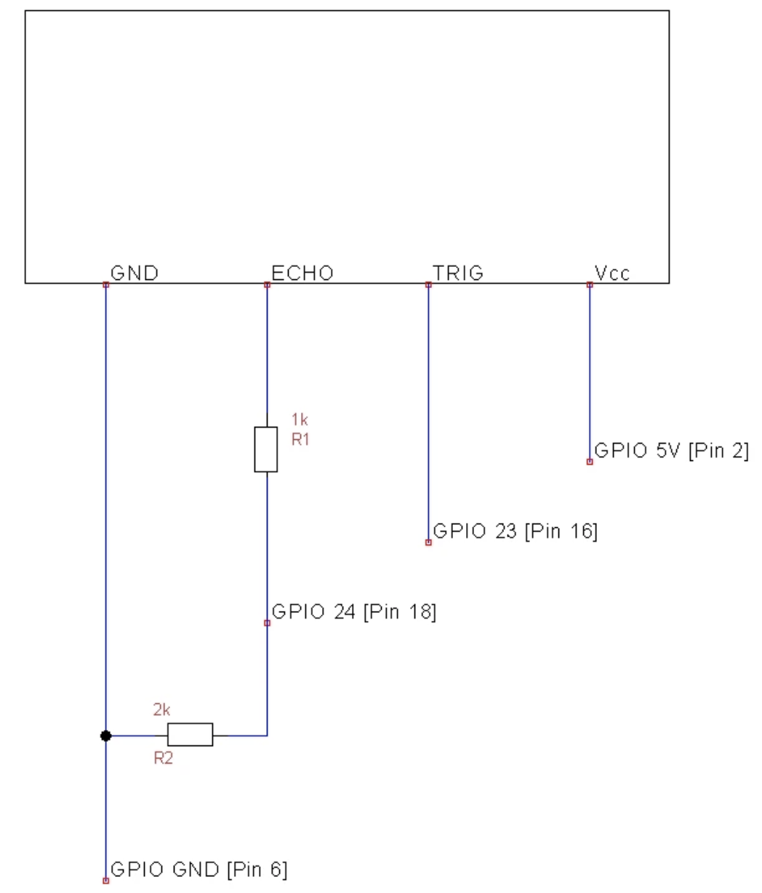

### Connected Ultrasonic Smart Trashcan
Smart Trashcan for Cumulocity IoT as seen at IoT World 2019. This is utilizing a HR-SC04 ultrasonic sensor on Raspberry Pi on the Cumulocity IoT Platform 

### Prerequisites

Pre-requisites:
- Python (tested on Python 3.6+)
- 'json', 'requests', 'paho-mqtt' packages installed (e.g. pip install xxx)
- Cumulocity tenant with Basic Authentication 
- HR-SC04 Ultrasonic Connector hooked to Raspberry Pi using 

### Hardware  
You need the following components:
- Breadboard
- HC-SR04 Sensor
- 1kΩ Resistor
- 2kΩ Resistor
- Jumper Wires

The HC-SR04 ultrasonic distance sensor's voltage needs to be regulated from 5V to 3.3V to prevent damage to your hardware. Wire the ultrasonic sensor based on the following circut below:
 

### Script Modifications:
Open the smartTrash.py script, and modify the following:

- Tenant URL
This is your own personal C8Y ID

- clientID
This could be anything. This is used as a unique identifier for your MQTT messages to be mapped to a device and assist in device creation.

- tenantID
Unique system generated ID for your tenant. You can get the tenantID by running the following API Call

```
	GET /tenant/currentTenant
```

- username/password.
Basic Auth is fine for MQTT messages. Although it's not required, you will need to encode it in Base64 if you plan on using the API calls. 

Synatax for Basic Auth in Base64 is as follows:

```
	Basic tenantID/username:password
```


Client ID should be unique per device (if you plan on creating multiple devices). This will be used in the MQTT call.

### Running

- Run the python script though your console, ensuring the Python environment and required packages are available in the path.

```
	>> python ./smartTrash.py
```

This should automatically trigger device creation in Cumulocity and the distance measurements on the python console should start being posted under the measurements tab under device management application for your specific device. You can then start creating a dashboard and apama analytics rules to further built on this demo. 
